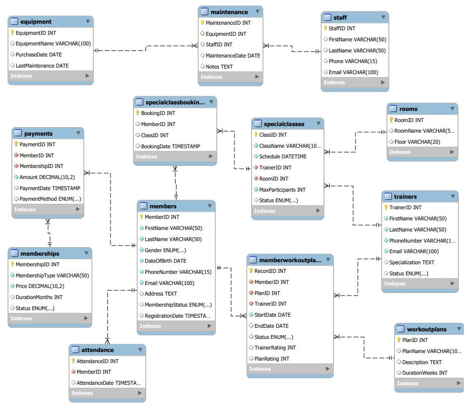

# SQL Gym Management System: A Data Analytics Project
A comprehensive project to design, implement, and analyze a relational database for a Gym Management System. This project demonstrates skills in database design, SQL (DDL, DML, DQL), data integrity enforcement, and business intelligence analysis using a realistic gym scenario.

## Table of Contents

- [Project Description](#project-description)  
- [Problem Statement](#problem-statement)  
- [Database Design](#database-design)  
- [ER Diagram](#er-diagram)  
- [Schema Overview](#schema-overview)  
- [Key Features & Analysis](#key-features--analysis)  
- [Data Integrity](#data-integrity)  
- [Real-World Data Manipulation](#real-world-data-manipulation)  
- [Business Intelligence Queries](#business-intelligence-queries)  
- [Advanced Analytical Applications](#advanced-analytical-applications)  
- [Technologies & Methods Used](#technologies--methods-used)  
- [Repository Structure](#repository-structure)  
- [Limitations](#limitations)
- [Future Enhancements](#future-enhancements)

### Project Description
The goal of this project is to enhance the operational efficiency of a fitness center by developing a robust Gym Management System (GMS). By integrating membership tracking, trainer scheduling, class management, and financial transactions into a single relational database, this system provides a structured and scalable solution. The project utilizes Data Definition Language (DDL) for schema creation, Data Manipulation Language (DML) for populating the database, and Data Query Language (DQL) to derive actionable business insights, from revenue trends to member engagement patterns.
### Problem Statement
Traditional gym administration often relies on manual record-keeping, leading to several challenges that hinder growth and customer satisfaction. This project addresses the following core issues:
Inefficient Membership Tracking: Manual processes increase the risk of errors in managing renewals, expirations, and new member registrations.
Trainer Scheduling Conflicts: A lack of an organized system leads to chaotic scheduling and mismanagement of training staff.
Equipment Maintenance Issues: Improper tracking results in equipment breakdowns, reducing the quality of service for members.
Payment and Financial Errors: Manual payment handling can cause miscalculations, delayed renewals, and revenue loss.
Limited Data Insights: Without a structured database, gym owners struggle to analyze member engagement, peak usage hours, and overall business performance.
### Database Design
The GMS is built on a structured relational database that ensures efficient data organization, retrieval, and management.
### ER Diagram
The following Entity-Relationship diagram illustrates the database schema, including all tables and their relationships.



### Schema Overview
The database consists of 13 interconnected tables designed to cover all core gym operations:
- **Member Management:** Members, Memberships, Payments, Attendance
- **Trainer & Workout Plans:** Trainers, WorkoutPlans, MemberWorkoutPlans
- **Classes & Bookings:** Rooms, SpecialClasses, SpecialClassBookings
- **Equipment & Maintenance:** Equipment, Staff, Maintenance

### Key Features & Analysis

#### Data Integrity
The schema is fortified with a variety of constraints to ensure data integrity and accuracy:
- **Primary Keys & Foreign Keys** to establish and enforce relationships.
- **UNIQUE Constraints** to prevent duplicate records, such as member emails or phone numbers.
- **NOT NULL Constraints** to ensure essential fields are always populated.
- **CHECK Constraints** to enforce business rules (e.g., ratings must be between 1 and 10).
- **ENUM Constraints** to restrict values to predefined options (e.g., membership status).
- **ON DELETE CASCADE** to maintain referential integrity when records are deleted.

#### Real-World Data Manipulation
The project simulates several real-world business scenarios, demonstrating practical data manipulation skills:
- **Imputing Missing Data:** Corrected historical *RegistrationDate* records by using the earliest payment date for each member, ensuring data accuracy.
- **Improving Performance:** Added indexes on frequently searched columns (LastName, MemberID) to optimize query performance for front-desk lookups and analytical reports.
- **Handling Privacy Requests:** Implemented a process for deleting member data in compliance with privacy regulations like PIPEDA, using *ON DELETE CASCADE* to ensure all related records are removed.
- **Schema Evolution:** Used *ALTER TABLE* to modify column data types and add constraints as business requirements changed (e.g., accommodating international phone numbers).

#### Business Intelligence Queries
Advanced DQL statements were used to extract meaningful insights and answer key business questions.
**1. Analyze Monthly Revenue and Attendance Trends**
This query provides a combined view of financial performance and member engagement, helping management identify patterns and make strategic decisions.  

**Generated SQL:**
```sql
WITH REVENUE AS (
    SELECT
        DATE_FORMAT(PaymentDate, '%Y-%m') AS Month,
        SUM(Amount) AS TotalRevenue
    FROM Payments
    GROUP BY Month
),
Attendance AS (
    SELECT
        DATE_FORMAT(AttendanceDate, '%Y-%m') AS Month,
        COUNT(*) AS AttendanceCount
    FROM Attendance
    GROUP BY Month
)
SELECT
    R.Month,
    R.TotalRevenue,
    A.AttendanceCount
FROM REVENUE R
JOIN Attendance A ON A.Month = R.Month
ORDER BY R.Month;
```
**Business Value:** By tracking revenue against attendance, the gym can assess the effectiveness of pricing plans, identify seasonal dips, and optimize staffing for peak hours.

**2. Identify Inactive Members for Retention Campaigns**
This query identifies members who have been absent for more than 30 days, enabling proactive outreach to prevent churn.  

**Generated SQL:**
```sql
SELECT
    m.MemberID,
    m.FirstName,
    m.LastName,
    m.MembershipStatus,
    MAX(a.AttendanceDate) AS LastAttendanceDate,
    m.PhoneNumber,
    m.Email
FROM Members m
LEFT JOIN Attendance a ON m.MemberID = a.MemberID
GROUP BY m.MemberID, m.FirstName, m.LastName, m.MembershipStatus, m.PhoneNumber, m.Email
HAVING DATEDIFF(CURRENT_DATE, MAX(a.AttendanceDate)) > 30
   OR MAX(a.AttendanceDate) IS NULL;
```
**Business Value:** This targeted list allows the marketing team to launch retention campaigns, offering promotions or support to re-engage at-risk members and demonstrating a commitment to customer care.

### Advanced Analytical Applications
To maximize the value of the collected data, the project proposes two master tables designed for predictive modeling:
**1. Regression Analysis for Revenue Prediction:** A master table was designed to aggregate monthly metrics (membership counts by type, special class bookings, total attendance) to serve as features for a time-series or regression model aimed at forecasting future revenue.
**2. Churn Prediction Model:** A second master table was created to build a member-level profile, including demographics, tenure, payment history, and engagement metrics. This data can be used to train a logistic regression model to predict the likelihood of a member churning.
### Technologies & Methods Used
- Database: MySQL
- Data Insertion: Manual INSERT statements, bulk CSV imports.
- Data Generation: Excel RAND() function, and AI-assisted data generation.
- Analysis: SQL queries, including CTEs, window functions, joins, and aggregate functions.
- Visualization: ER Diagram.

### Repository Structure
├── sql_scripts/  
│ ├── 01_schema_creation.sql # DDL for creating tables and constraints  
│ ├── 02_dml_queries # Folder icludding DML for populating the 13 tables  
│ ├── 03_data_manipulation.sql # DML for scenarios to illustrate how the system can be modified to address business needs, improve data integrity, and accommodate future changes.  
│ └── 04_dql_queries.sql # DQL for business analysis  
├── visualizations/  
│ └── Diagram.jpg # Database ER Diagram  
└── README.md # This file

### Limitations
- Attendance Validation: The system does not prevent non-paying members from having their attendance logged.
- Logical Date Constraints: It is possible to set an equipment maintenance date before its purchase date.
- Sample Data: The dataset is generated and may not fully reflect real-world customer behavior.
### Future Enhancements
- Implement stricter constraints to prevent invalid payment and attendance records.
- Add validation for logical date sequences.
- Expand data tracking for member fitness progress, detailed trainer schedules, and equipment usage analytics to build more sophisticated models.

